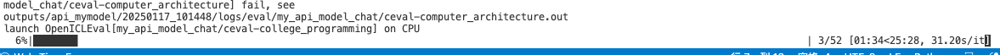
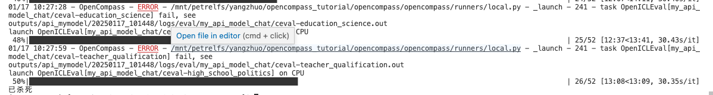

## 新增 api 模型测评

> 参考 [opencompass 支持新模型](https://opencompass.readthedocs.io/zh-cn/latest/advanced_guides/new_model.html)

### 一、新增 API 模型
在 `opencompass/modes` 下新建 `mymodel_api.py` 继承自 `BaseAPIModel`，并实现 `generate` 方法进行推理。这里以 zhipu_api 为例（因为我没有 openai_api_key）

```python
from concurrent.futures import ThreadPoolExecutor
from typing import Dict, List, Optional, Union

from opencompass.utils.prompt import PromptList

from .base_api import BaseAPIModel

PromptType = Union[PromptList, str]


class MyModelAPI(BaseAPIModel):
    """Model wrapper around ZhiPuAI.

    Args:
        path (str): The name of OpenAI's model.
        key (str): Authorization key.
        query_per_second (int): The maximum queries allowed per second
            between two consecutive calls of the API. Defaults to 1.
        max_seq_len (int): Unused here.
        meta_template (Dict, optional): The model's meta prompt
            template if needed, in case the requirement of injecting or
            wrapping of any meta instructions.
        retry (int): Number of retires if the API call fails. Defaults to 2.
    """

    def __init__(
        self,
        path: str,
        key: str,
        query_per_second: int = 2,
        max_seq_len: int = 2048,
        meta_template: Optional[Dict] = None,
        retry: int = 2,
    ):
        super().__init__(path=path,
                         max_seq_len=max_seq_len,
                         query_per_second=query_per_second,
                         meta_template=meta_template,
                         retry=retry)
        import zhipuai
        self.zhipuai = zhipuai
        self.zhipuai.api_key = key
        self.model = path

    def generate(
        self,
        inputs: List[PromptType],
        max_out_len: int = 512,
    ) -> List[str]:
        """Generate results given a list of inputs.

        Args:
            inputs (List[PromptType]): A list of strings or PromptDicts.
                The PromptDict should be organized in OpenCompass'
                API format.
            max_out_len (int): The maximum length of the output.

        Returns:
            List[str]: A list of generated strings.
        """
        with ThreadPoolExecutor() as executor:
            results = list(
                executor.map(self._generate, inputs,
                             [max_out_len] * len(inputs)))
        self.flush()
        return results

    def _generate(
        self,
        input: PromptType,
        max_out_len: int = 512,
    ) -> str:
        """Generate results given an input.

        Args:
            inputs (PromptType): A string or PromptDict.
                The PromptDict should be organized in OpenCompass'
                API format.
            max_out_len (int): The maximum length of the output.

        Returns:
            str: The generated string.
        """
        assert isinstance(input, (str, PromptList))

        if isinstance(input, str):
            messages = [{'role': 'user', 'content': input}]
        else:
            messages = []
            for item in input:
                msg = {'content': item['prompt']}
                if item['role'] == 'HUMAN':
                    msg['role'] = 'user'
                elif item['role'] == 'BOT':
                    msg['role'] = 'assistant'
                messages.append(msg)

        data = {'model': self.model, 'prompt': messages}

        max_num_retries = 0
        while max_num_retries < self.retry:
            self.acquire()
            response = self.zhipuai.model_api.invoke(**data)
            self.release()

            if response is None:
                print('Connection error, reconnect.')
                # if connect error, frequent requests will casuse
                # continuous unstable network, therefore wait here
                # to slow down the request
                self.wait()
                continue
            if response['code'] == 200 and response['success']:
                msg = response['data']['choices'][0]['content']
                return msg
            # sensitive content, prompt overlength, network error
            # or illegal prompt
            if (response['code'] == 1301 or response['code'] == 1261
                    or response['code'] == 1234 or response['code'] == 1214):
                print(response['msg'])
                return ''
            print(response)
            max_num_retries += 1

        raise RuntimeError(response['msg'])
```
上面对于 ZhiPuAI 的封装主要做了以下几件事
1. 初始化
   * 接受模型路径，API密钥，每秒查询次数，最大序列长度，元模板和重试次数等参数
   * 初始化 API 客户端，设置 API 密钥和模型路径
   上述参数我们都会在配置文件中给出
2. 封装 `generate` 函数
    * 接受一个输入列表，可以是字符串或 `PromptList` ，并生成相应的输出
    * 使用 `ThreadPoolExecutor` 并发处理多个输入，调用 `_generate` 方法生成结果
    * 对 API 调用过程中可能出现的错误进行处理，如网络错误、敏感内容、提示过长等
### 二、 将 `mymodel_api.py` 导出为 `Python package`
在 `opencompass/models/__init__.py` 中加入下一行代码

```python
from .mymodel_api import MyModelAPI
```

### 三、新增配置文件
在 `configs/api_examples/eval_api_mymodel.py` 中添加 python 配置，我这里使用 glm4-flash 为例
```python
from opencompass.models import MyModelAPI
from mmengine.config import read_base
from opencompass.partitioners import NaivePartitioner
from opencompass.runners.local_api import LocalAPIRunner
from opencompass.tasks import OpenICLInferTask

with read_base():
    from opencompass.configs.summarizers.medium import summarizer
    from opencompass.configs.datasets.ceval.ceval_gen import ceval_datasets

datasets = [
    *ceval_datasets,
]

from opencompass.utils import general_eval_wrapper_postprocess
for _dataset in datasets:
    if _dataset['abbr'] not in ['gsm8k', 'strategyqa']:
        if hasattr(_dataset['eval_cfg'], 'pred_postprocessor'):
            _dataset['eval_cfg']['pred_postprocessor']['postprocess'] = _dataset['eval_cfg']['pred_postprocessor']['type']
            _dataset['eval_cfg']['pred_postprocessor']['type'] = general_eval_wrapper_postprocess
        else:
            _dataset['eval_cfg']['pred_postprocessor'] = {'type': general_eval_wrapper_postprocess}


models = [
    dict(
        abbr = 'my_api_model_chat',
        type = MyModelAPI,
        path='glm-4-flash',
        key='',  # 添加你的 api_key
        url='https://open.bigmodel.cn/api/paas/v4/chat/completions',
        query_per_second=1,
        max_out_len=2048,
        max_seq_len=2048,
        batch_size=8
    )
]


infer = dict(
    partitioner=dict(type=NaivePartitioner),
    runner=dict(
        type=LocalAPIRunner,
        max_num_workers=2,
        concurrent_users=2,
        task=dict(type=OpenICLInferTask)),
)

work_dir = 'outputs/api_mymodel/'
```

### 四、终端执行评测
```bash
python run.py configs/api_examples/eval_api_mymodel.py
```

使用 Slurm 集群进行调度
```bash
srun --gres=gpu:4 --partition=AI4Phys python run.py configs/api_examples/eval_api_mymodel.py
```


 
可能是资源不够，我是在 cpu 上跑的，作业被集群 kill 掉了 
