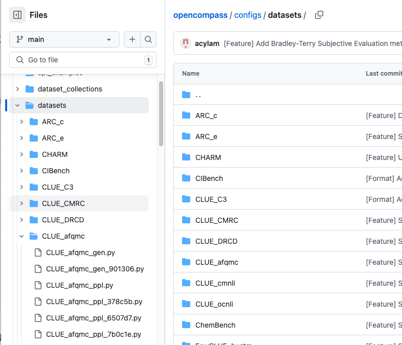

### OpenCompass 数据集模块介绍

OpenCompass 支持的数据集主要包括三个方面：
1. Huggingface 数据集，当使用到这部分数据集时会自动下载，具体数据集支持可见 https://huggingface.co/datasets
2. ModelScope 数据集，OpenCompass 在ModelScope平台上也上传了其数据集，当使用时也会自动下载，可用的数据集来源于`OpenCompassData-core.zip`
3. 自建以及第三方数据集：OpenCompass 提供了第三方数据集和自建中文数据集，在根目录下运行命令可以手动下载解压至`OpenCompass/data`目录下：

```python
wget https://github.com/open-compass/opencompass/releases/download/0.2.2.rc1/OpenCompassData-core-20240207.zip
unzip OpenCompassData-core-20240207.zip
```

源码中，数据集存在于 `config/datasets` 目录下



datasets下的各一级目录代表数据集，二级目录以`.py`结尾的是不同版本数据集配置文件，命名由以下方式构成，`{数据集名称}_{评测方式}_{prompt版本号}.py`。

以 `CLUE_afqmc/CLUE_afqmc_gen_db509b.py` 为例，该配置文件则为中文通用能力下的 `CLUE_afqmc` 数据集，对应的评测方式为 `gen`，即生成式评测，对应的`prompt`版本号为 `db509b`；同样的， `CLUE_afqmc_ppl_00b348.py` 指评测方式为`ppl`即判别式评测，`prompt`版本号为 `00b348` 。

> 不带版本号的，是指向该评测方式最新的prompt配置文件，通常来说是精度最高的

在数据集配置文件中，数据集会被定义在`{}_datasets`变量中，并制定其路径及配置，例如：
```python
afqmc_datasets = [
    dict(
        abbr="afqmc-dev",
        type=AFQMCDatasetV2,
        path="./data/CLUE/AFQMC/dev.json",
        reader_cfg=afqmc_reader_cfg,
        infer_cfg=afqmc_infer_cfg,
        eval_cfg=afqmc_eval_cfg,
    ),
]
```

### 自定义数据集

### 如何支持新数据集

