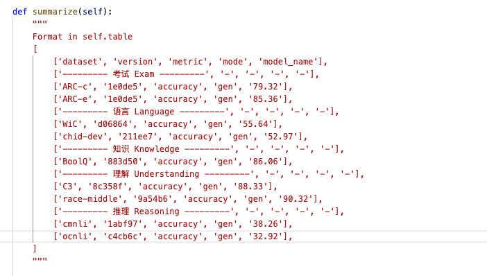
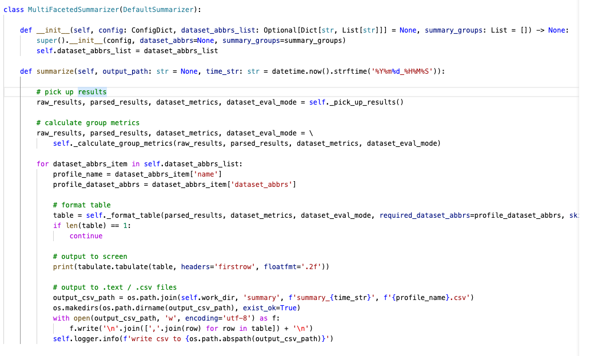
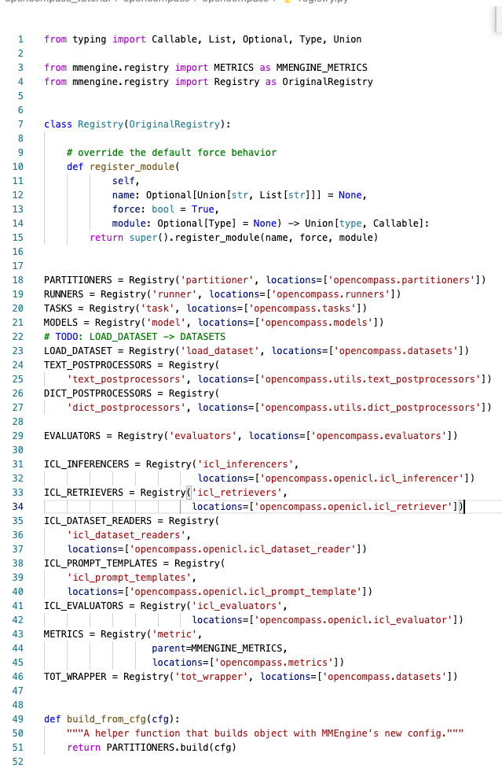

### 如何发起评测
在之前，我们已经进行了 datasets 和 models 的配置，现在要看看具体怎么发起一个评测任务。

评测任务的程序入口为`run.py`，它允许接受一个.py配置文件作为任务相关参数，这个配置文件统一位于 configs/*.py中，里面需要包含 datasets 和 models 字段
```python
python run.py configs/eval_demo.py
```

如果不传入配置文件，用户也可以通过`--models`和`--datasets` 来指定模型和数据集，例如下述命令
```python
python run.py --models hf_opt_125m --datasets siqa_gen 
```
这行分别指定模型为`hf_opt_125m`，模型文件封装在`configs/models`中；数据集指定为 `siga_gen` ，数据集被封装在`configs/datasets`中

对于 `HuggingFace` 相关模型，用户也可以通过 `HuggingFace` 参数在命令行中快速定义一个模型，再通过 `--datasets` 参数定义数据集。因为前面聊模型的时候聊到，
`OpenCompass` 对于 `HuggingFace` 所支持的模型，直接从  `AutoModel.from_pretrained` 和 `AutoModelForCausalLM.from_pretrained` 接口实例化评测模型的。

在 `opencompass/cli/main.py` 下面我们也可以看到具体对于 hf 全量参数的介绍

具体的命令可能如下行所示：
```python
python run.py --datasets siqa_gen winograd_ppl --hf-type base --hf-path huggyllama/llama-7b
```

#### 评测结果
所有评测运行结果会默认被防止在 outputs/default/ 目录下，目录结构可能如下所示：
```python
outputs/default/
├── 20200220_120000
├── ...
├── 20230220_183030
│   ├── configs
│   ├── logs
│   │   ├── eval
│   │   └── infer
│   ├── predictions
│   │   └── MODEL1
│   └── results
│       └── MODEL1
```

### 底层原理分析
> 由于源代码进行了层层封装，我一直在思考一个问题🤔，为什么执行 run.py 之后，评测就可以完成了呢？

要回答这个问题，还需要了解 OpenCompass 的其他一些概念，包括但不限于：
* **Tasks**：用于执行计算密集的操作，实例化后可通过 `task.run()` 方法执行
* **Partitioner**：任务划分器，将大模型任务按照自定义的策略划分成众多独立的小任务，通过并行运行充分利用计算资源。请参考 [Partitioner](https://opencompass.readthedocs.io/zh-cn/latest/user_guides/evaluation.html#partitioner)
* **Runner**：运行后端，在集群管理系统中需要依赖调度后端，`OpenCompass` 通过 `Runner` 对象完成任务的分配，目前支持 `Slurm`、`PAI-DLC`两种调度后端和本地 `Runner`
* **Evaluater**：根据不同的任务，进行打分，下面展示的是 `OpenCompass` 的 `Evaluator` 基类。大致上是根据 `predictions` 和 `references` 根据某种规则计算 `score` 
    ```python
    """Base Evaluator."""

    class BaseEvaluator:
    
        def __init__(self) -> None:
            pass
    
        def score(self):
            raise NotImplementedError("Method hasn't been implemented yet")
    
        @staticmethod
        def is_num_equal(predictions, references):
            if len(predictions) != len(references):
                return {'error': 'preds and refrs have different length'}
            else:
                return

    ```
* **Summarizers**：评测完成后，评测结果的保存，打印，是由 `summarizer` 控制的。每一个具体的 `Summarizer` 类具体实现细节都不太一样，核心方法都是 `summarize` ，用于返回评测结果到屏幕或相关荧幕上。官方文档截止到 1.16 日没有更新相关内容，以 `MultiModelSummarizer` 和 `MultiFacetedSummarizer`的 `summarize` 方法为例
    

    

在源码中，先封装了一个 `Registry` 类，用于集中注册我们上述所说的各种概念实例化后的对象。这部分逻辑写在 `opencompass/registry.py` 中，传送门 --> [registry.py](https://github.com/open-compass/opencompass/blob/main/opencompass/registry.py)

具体来说，只用到了 Registry 类的 get 和 build 方法，查阅 [mmengine/registry/registry.py](https://github.com/open-mmlab/mmengine/blob/main/mmengine/registry/registry.py#L384) 之后，
* `get`: 用于从注册表(Registry)中获取已注册的类或对象
  ```python
    # 根据注册项的名称(models)，定义一个注册表(MODELS)
    MODELS = Registry('models')  
    # 将 Resnet 模型注册到 MODELS 注册表中
    @MODELS.register_module()
    class ResNet:
        pass
    # 从注册表中获取 resnet_class
    resnet_cls = MODELS.get('ResNet')
  ```
* build：根据配置字典(cfg)在注册表中构建一实例
  ```python
    from mmengine import Registry
    MODELS = Registry('models')
    @MODELS.register_module()
    class ResNet:
        def __init__(self, depth, stages=4):
            self.depth = depth
            self.stages = stages

    cfg = dict(type="ResNet", depth=50)
    model = MODELS.build(cfg)
    ```

在 [opencompass/cli/main.py](https://github.com/open-compass/opencompass/blob/main/opencompass/cli/main.py) 中
，除了很多对于参数的解析，还有 `evaluate`, `visualize` 等具体逻辑的实现，前文完成注册表的注册后，通过实例化 `runner` `partitioner` `summarizer` 等对象完成评估和结果的展示。

> 上述的内容部分没有找到参考资料，是我个人看代码后的理解，如有错误欢迎联系改正
