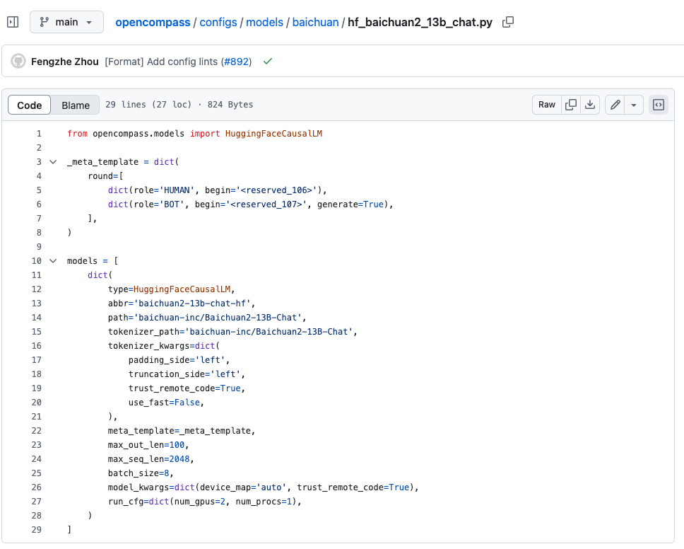
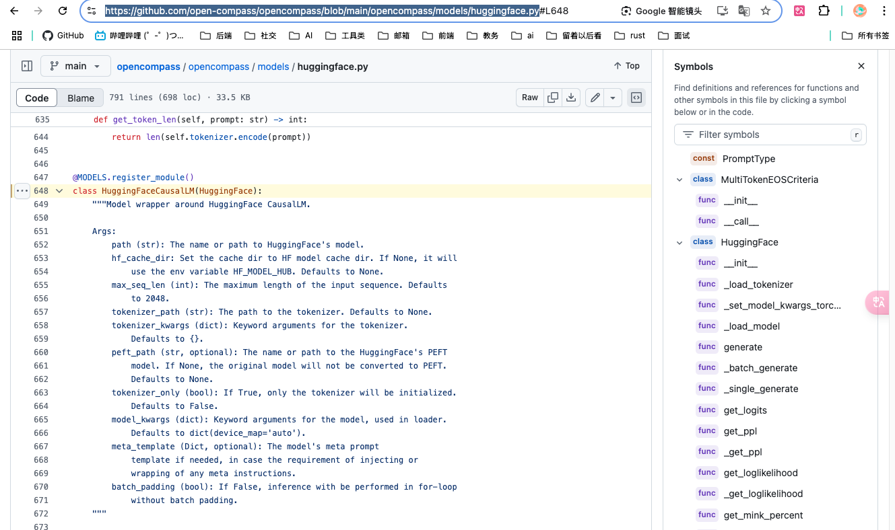
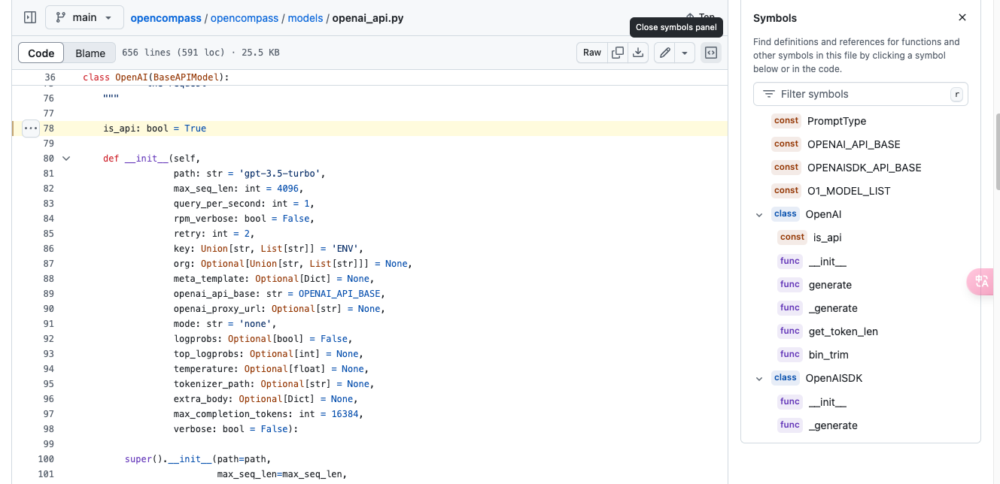
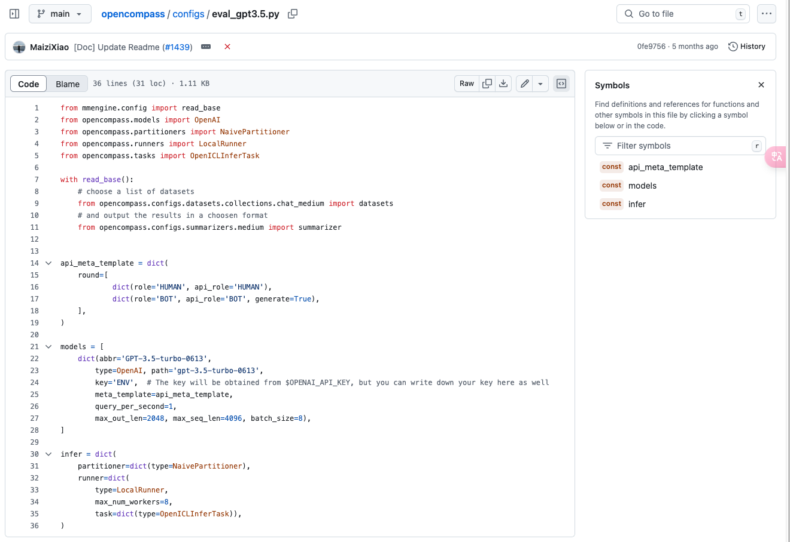

### 准备模型
OpenCompass 中支持以下三种方式的模型评测 

#### 基于 HuggingFace 的模型
直接从 Huggingface 的 AutoModel.from_pretrained 和 AutoModelForCausalLM.from_pretrained 接口构建评测模型。如果需要评测的模型符合 HuggingFace 模型通常的生成接口， 则不需要编写代码，直接在配置文件中指定相关配置即可。
对于 HuggingFace的封装，源代码可以参考：[opencompass/models/huggingface.py](https://github.com/open-compass/opencompass/blob/main/opencompass/models/huggingface.py)

这里用 `baichuan2_13b_chat` 作为理解

[源代码](https://github.com/open-compass/opencompass/blob/main/configs/models/baichuan/hf_baichuan2_13b_chat.py)



按照 Python风格的配置文件，对于模型的配置可以大致分为三部分：
1. type：使用的模型类型，具体封装在[opencompass/opencompass/models](https://github.com/open-compass/opencompass/tree/main/opencompass/models)之下，例如上图展示的 `type=VLLM`,
VLLM类封装在对应的 `opencompass/opencompass/models/vllm.py`下
2. 初始化参数
    与模型本身直接相关的，用于实例化模型，例如上面的 path--指定模型路径,tokenizer_path, tokenizer_kwargs等
3. 其他参数
    用于模型推理及其他个性化的设置，与模型本身并无相关性，例如 abbr用于结果展示时模型的简称，batch

评测开始时，OpenCompass首先会使用配置文件的 type和初始化参数实例化模型，再用其他参数进行推理和总结。例如上图中，我们首先执行的是实例化过程
```python
model = HuggingFaceCausalLM(
    type=HuggingFaceCausalLM,
    path='baichuan-inc/Baichuan2-13B-Chat',
    tokenizer_path='baichuan-inc/Baichuan2-13B-Chat',
    tokenizer_kwargs=dict(padding_side='left', truncation_side='left'),
    tokenizer_kwargs=dict(
        padding_side='left',
        truncation_side='left',
        trust_remote_code=True,
        use_fast=False,
    )
    .......
)
```

具体该使用哪些参数，需要去对应 type模型的封装文件中查阅（模型太多，opencompass也没法提供详尽的 API文档），例如`HuggingFaceCausalLM`，我们可以找到以下参数




#### 基于 API 的模型
OpenCompass为我们提供了基类 BaseAPIModel，我们测评模型时， 大体上分为两步

首先在 `opencompass/models`目录下实现该模型类，拿 `openai_api`举例



需要注意的是，基于 api 的模型要调用，首先需要获得 api_key，并且将 api 调用的 url 添加在环境中。
```python
import os

OPENAI_API_BASE = os.path.join(
    os.environ.get('OPENAI_BASE_URL', 'https://api.openai.com/v1/'),
    'chat/completions')
OPENAISDK_API_BASE = os.environ.get('OPENAI_BASE_URL',
                                    'https://api.openai.com/v1/')
```
具体内容只要注重 `generate` 的方式实现就差不多了

第二步，就是在`opencompass/configs`下添加对应的评测文件，评测文件还是基于 Python 风格的配置文件。



上述代码主要完成了数据集的定义，api元信息模板定义，模型的定义以及推理任务的配置。

#### 自定义模型
目前对于模型类的实现，基础类 OpenCompass提供了两个，均位于`opencompass/models`目录下，
分别为`BaseModel`和`BaseAPIModel`。

首先分别介绍几种对模型输出结果的客观评测方法
* 判别式评测：该评测方式基于将问题与候选答案组合在一起，计算模型在所有组合上的困惑度（perplexity），并选择困惑度最小的答案作为模型最终输出
* 生成式评测：该评测方式主要用于生成类任务，如语言翻译、程序生成、逻辑分析题等。在具体实践中，使用问题作为模型的原始输入，并留白答案区域待模型进行补全。
> 相对于客观评测方法，主观评测是根据人的主观感受为主，借助受试者的主观判断对大模型进行能力评测

在自定义模型时，首先需要基于基类，实现 `generate` 方法来进行生成式推理，`get_ppl` 方法进行判别式推理，最后实现`get_token_len`方法计算 token的长度

```python
# API Model
from ..base_api import BaseAPIModel

class MyModelAPI(BaseAPIModel):

    is_api: bool = True

    def __init__(self,
                 path: str,
                 max_seq_len: int = 2048,
                 query_per_second: int = 1,
                 retry: int = 2,
                 **kwargs):
        super().__init__(path=path,
                         max_seq_len=max_seq_len,
                         meta_template=meta_template,
                         query_per_second=query_per_second,
                         retry=retry)
        ...

    def generate(
        self,
        inputs,
        max_out_len: int = 512,
        temperature: float = 0.7,
    ) -> List[str]:
        """Generate results given a list of inputs."""
        pass

    def get_token_len(self, prompt: str) -> int:
        """Get lengths of the tokenized string."""
        pass

# BaseModel
from ..base import BaseModel

class MyModel(BaseModel):

    def __init__(self,
                 pkg_root: str,
                 ckpt_path: str,
                 tokenizer_only: bool = False,
                 meta_template: Optional[Dict] = None,
                 **kwargs):
        ...

    def get_token_len(self, prompt: str) -> int:
        """Get lengths of the tokenized strings."""
        pass

    def generate(self, inputs: List[str], max_out_len: int) -> List[str]:
        """Generate results given a list of inputs. """
        pass

    def get_ppl(self,
                inputs: List[str],
                mask_length: Optional[List[int]] = None) -> List[float]:
        """Get perplexity scores given a list of inputs."""
        pass
```

> 详细内容请参考：https://opencompass.readthedocs.io/zh-cn/latest/advanced_guides/new_model.html